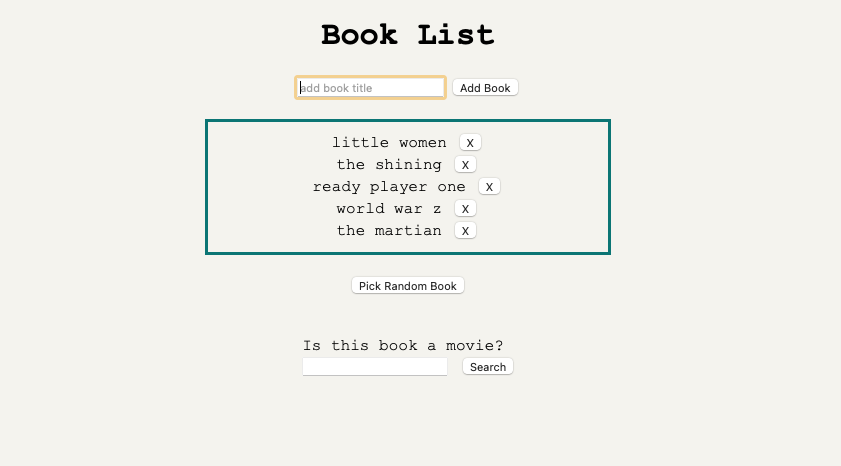
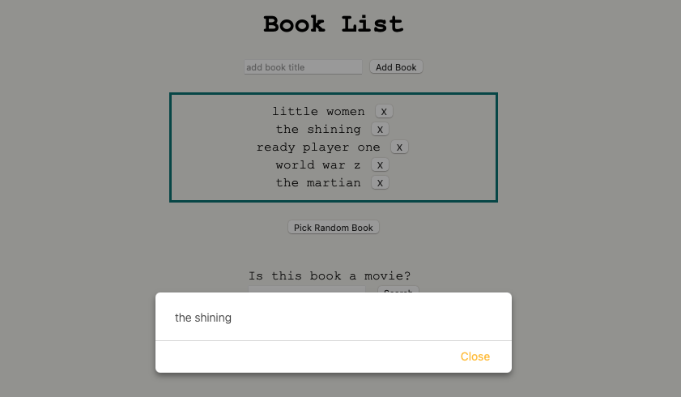
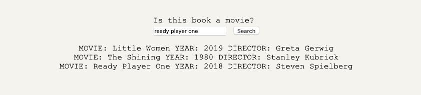

# Book List

 ## Description

 This project allows users to add book titles to a list. The Get Random Book button will return a random title from the list. This feature was added in case a user is indecisive on what book to read next. The user can then enter the title into the search bar to check if the book was made into a movie (helpful in case user would rather watch the movie). The list also allows users to delete titles from the list. 

 ## Tech Stack 

 * HTML
 * CSS
 * JavaScript
 * Nodejs
 * OMDb API

 
 
 